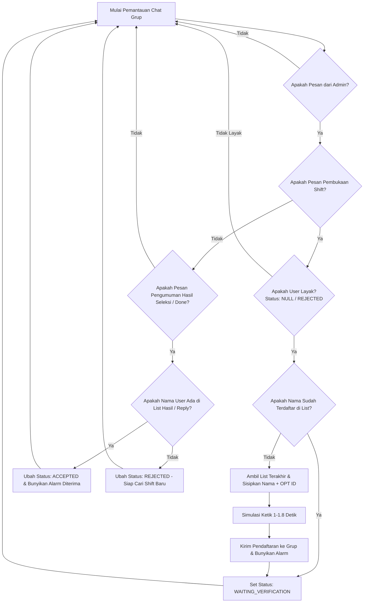

# 🤖 SRAS (Shift Registration Automation System)
### *Bot Asisten Registrasi Shift WhatsApp Otomatis dengan Kecepatan Kompetitif & Validasi Kelayakan Pintar*

[](https://nodejs.org/)
[](https://opensource.org/licenses/MIT)
[](https://jestjs.io/)
[](#)

---

**SRAS (Shift Registration Automation System)** adalah solusi otomatisasi tingkat lanjut yang dirancang khusus untuk membantu para Pekerja Harian (*Daily Workers*) memenangkan persaingan pendaftaran shift kerja di grup WhatsApp Vendor. 

Dengan menggabungkan kecepatan respons tingkat milidetik, kecerdasan buatan dalam mem-parsing daftar nama, penanganan kondisi balapan (*race condition*), serta validasi status kelayakan harian, SRAS memastikan Anda selalu terdaftar dengan nomor urut yang tepat tanpa melanggar aturan vendor.

---

## 🚀 Fitur Unggulan (Unique Selling Points)

*   **⚡ Kecepatan Kompetitif dengan Kamuflase Manusia (*Typing State*)**
    Merespons pembukaan shift dari admin secara instan dengan jeda acak kompetitif (1.0 s.d 1.8 detik) sembari mengaktifkan status "Sedang Mengetik..." (*typing state*) di grup WhatsApp untuk meniru perilaku manusia secara alami demi menghindari blokir.
*   **👥 Caching Pesan Dinamis & Penanganan *Race Condition* (Anti-Tabrakan)**
    Sistem memantau seluruh lalu lintas chat masuk dan keluar (`message_create`) secara real-time. Jika ada pendaftar lain yang mengirim pesan pada milidetik yang sama selama jeda bot mengetik, sistem akan otomatis melakukan sinkronisasi ulang agar nomor urut Anda tidak menimpa pendaftar lain.
*   **🛡️ Aturan Bisnis & Kelayakan Ketat (BR-001 s.d BR-010)**
    Melindungi akun Anda dari pendaftaran ganda dan pelanggaran aturan vendor:
    *   **Accepted**: Mematikan pendaftaran otomatis untuk hari yang sama jika Anda sudah diterima kerja.
    *   **Waiting Verification**: Mengunci pendaftaran ke shift lain selama Anda masih menunggu hasil seleksi dari admin.
    *   **Rejected**: Mengaktifkan kembali bot secara otomatis untuk memburu shift berikutnya jika Anda dicoret/ditolak dari daftar.
*   **📝 Verifikasi Hasil Seleksi Cerdas (Auto-Verification)**
    *   Mendeteksi pengumuman admin baik berupa pesan `"done"`, `"fix list"`, `"lolos"`, maupun `"diterima"`.
    *   **Fallback Quoted Message**: Jika admin mengirim pesan `"done"` dengan me-reply ke pesan pembukaan awal (yang belum berisi nama Anda), bot secara otomatis melakukan fallback mencari list terupdate Anda di cache lokal.
    *   Dukungan toleransi tinggi terhadap format daftar pendaftaran menggunakan regex multiline `/^\s*[-*•+\d+.]\s*/m`.
*   **🔌 Metode Koneksi WhatsApp yang Fleksibel**
    Mendukung penautan cepat menggunakan **Pairing Code** (cukup masukkan nomor HP di terminal untuk mendapatkan 8 digit kode penautan WhatsApp) atau scan **QR Code** tradisional.
*   **🚨 Alarm Suara Lokal & Webhook IFTTT**
    Membunyikan alarm suara laptop/PC saat pendaftaran dikirim dan saat status Anda dinyatakan **ACCEPTED** (diterima kerja) agar Anda tidak melewatkan panggilan kerja secara fisik, serta mendukung integrasi notifikasi HP.
*   **🖥️ Dasbor CLI Interaktif & Wizard Admin Otomatis**
    Dilengkapi menu CLI dasbor utama untuk mempermudah operasional: mengubah nama/OPT ID langsung dari terminal, meriset status harian, hingga wizard rekam ID admin grup secara otomatis.

---

## 📊 Alur Kerja Sistem (System Workflow)



---

## 🛠️ Instalasi & Persiapan

### A. Persyaratan Sistem
*   **Node.js**: Versi 18 atau lebih tinggi.
*   **Git**: Untuk kloning repositori.

### B. Langkah Instalasi (Windows / Linux / macOS)
1.  Kloning repositori ini:
    ```bash
    git clone https://github.com/daeng1502/sras.git
    cd sras
    ```
2.  Instal seluruh dependensi:
    ```bash
    npm install
    ```
3.  Jalankan aplikasi:
    ```bash
    npm start
    ```
    *(Pada jalankan pertama, Anda dapat langsung mengatur nama, OPT ID, dan nomor HP secara interaktif melalui **Menu Utama CLI Pilihan 2**).*

### C. Langkah Instalasi di Android Termux (Portabel di HP)
Aplikasi ini dioptimalkan penuh agar dapat berjalan di Android Termux secara portabel menggunakan headless Chromium.
1.  Unduh dan instal aplikasi **Termux** serta aplikasi pendamping **Termux:API** dari [F-Droid](https://f-droid.org/) (pastikan keduanya diunduh dari F-Droid agar tanda tangan paket/signatures cocok dan kompatibel).
2.  Buka Termux di HP Anda, kloning proyek ini, dan jalankan skrip instalasi otomatis:
    ```bash
    git clone https://github.com/daeng1502/sras.git
    cd sras
    chmod +x termux-setup.sh
    ./termux-setup.sh
    ```
3.  Skrip tersebut akan otomatis menginstal Node.js, Git, paket CLI `termux-api`, Chromium, serta mengonfigurasi variabel lingkungan Puppeteer secara otomatis.

---

## ⚙️ Panduan Konfigurasi (.env)

Meskipun disarankan menggunakan **Menu CLI Pilihan 2** untuk pengisian otomatis yang lebih mudah, Anda juga tetap dapat membuat/mengedit berkas `.env` secara manual di folder root dengan isi parameter berikut:

```env
# Profil Pengguna
USER_NAME="Daeng"              # Nama lengkap Anda yang akan ditulis di list pendaftaran
USER_OPT_ID="2015150"          # OPT ID Anda (misal ID Karyawan/Operator)
USER_HP="6282218454332"        # Nomor HP WhatsApp Anda (untuk Pairing Code)

# Target Pemantauan WhatsApp
TARGET_GROUP_NAME="120363412551488757@g.us"  # Nama Grup WA atau JID grup secara langsung (Lebih direkomendasikan JID)

# Daftar Nomor HP Admin Vendor yang Sah (Dipantau pesan-pesannya)
MONITORED_ADMINS="48533214335195,628123456789"
```

> [!TIP]
> Menggunakan **JID Grup secara langsung** (seperti `120363412551488757@g.us`) pada kolom `TARGET_GROUP_NAME` sangat direkomendasikan karena bot akan langsung mengunci grup tersebut saat baru dinyalakan tanpa menunggu sinkronisasi nama grup dari WhatsApp Web.

---

## 🖥️ Dasbor Menu Utama (CLI)

Saat Anda menjalankan `npm start`, Anda akan disuguhkan dasbor utama yang sangat mudah digunakan:

```text
==================================================
        MENU UTAMA BOT REGISTRASI SHIFT (SRAS)
==================================================
1. Mulai Monitoring & Otomasi
2. Atur Profil & Konfigurasi (.env)
3. Reset Status Harian (Uji Coba Ulang)
4. Logout WhatsApp (Hapus Sesi)
5. Keluar
==================================================
Pilih Menu (1-5): 
```

*   **Pilihan 1 (Monitoring & Otomasi)**: Memulai pemantauan grup WhatsApp secara real-time. Anda akan diminta memasukkan filter kata kunci shift (jika ada, kosongkan untuk mengambil semua shift) dan opsi untuk mengaktifkan kirim pendaftaran otomatis.
*   **Pilihan 2 (Atur Profil)**: Sub-menu interaktif untuk mengubah konfigurasi tanpa perlu membuka berkas `.env` secara manual.
*   **Pilihan 3 (Reset Status)**: Mereset status kelayakan hari ini menjadi `NULL` untuk keperluan simulasi pendaftaran ulang.

---

## 🧪 Pengujian Unit & Penjaminan Mutu

SRAS dilengkapi dengan rangkaian pengujian unit otomatis menggunakan Jest untuk menjamin seluruh logika parsing dan verifikasi berjalan 100% akurat sebelum digunakan di grup produksi.

Untuk menjalankan tes:
```bash
npm test
```

Hasil pengujian saat ini:
*   **Test Suites**: 4 passed, 4 total
*   **Tests**: 44 passed, 44 total
*   **Snapshots**: 0 total

---

## 📄 Lisensi & Disclaimer

Proyek ini dirilis di bawah lisensi [MIT License](LICENSE).

**DISCLAIMER**: Alat ini dikembangkan hanya untuk tujuan pembelajaran, otomatisasi produktivitas pribadi, dan penelitian. Penggunaan bot otomatis untuk berinteraksi dengan WhatsApp diatur oleh Ketentuan Layanan WhatsApp. Developer tidak bertanggung jawab atas segala konsekuensi pemblokiran nomor atau sanksi dari pihak ketiga akibat penggunaan alat ini di grup produksi. Gunakan dengan bijak dan bertanggung jawab.
